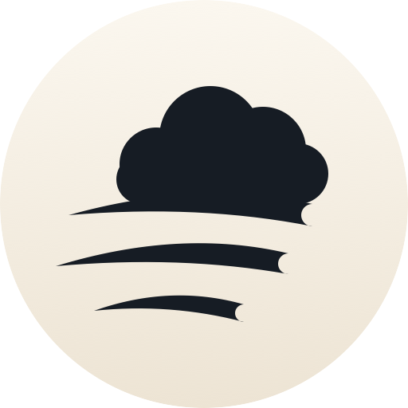
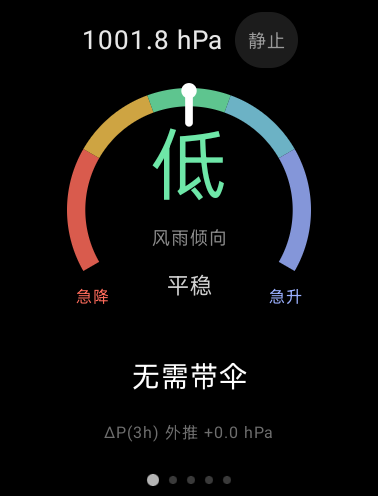
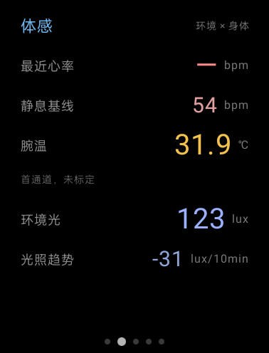
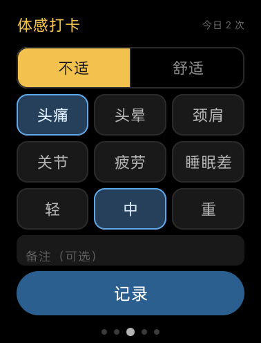
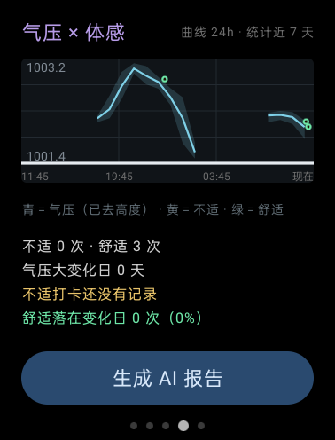
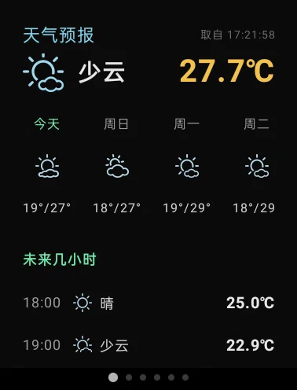
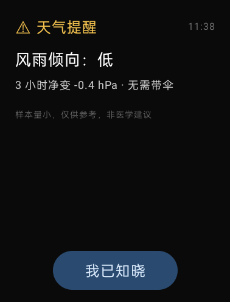
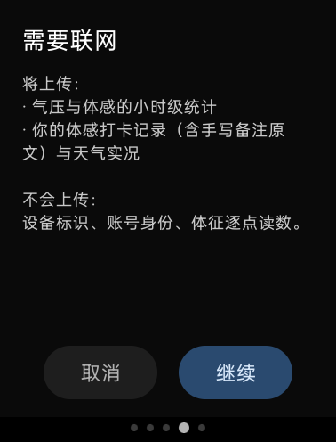
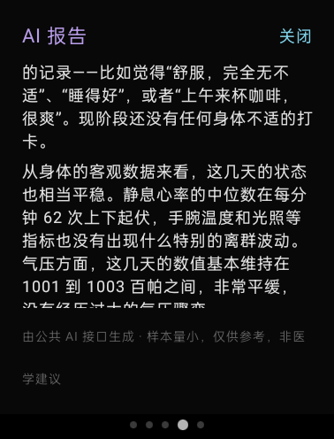

<div align="center">



# 观风 · GuanFeng

**把气压计戴在手腕上**

一个以离线为主的微气象仪：气压判定、打卡、关联全部在手表上完成。它看气压的短临变化，也看你身体的反应——<br/>
然后把这两件事画在同一张图上。

<br/>

-1F6FEB?style=flat-square)


[](https://gualing.top)

</div>

---

## 为什么做它

气象台会告诉你"今天有雨"。它不会告诉你，**再过四十分钟，你右后脑会开始发紧**。

这两件事之间隔着一个变量：**气压**。天气系统来临时气压先动，人的身体往往比天气预报更早察觉。观风把这两个信号绑在一条时间轴上——**此刻的气压**，和**此刻你的身体**——然后等上几十天，让数据自己说话。

它是一件个人仪器，不是一个天气 App：没有登录、没有推送、没有广告，**核心判定（气压趋势、高度解耦、打卡、关联）一次网络请求都不发**。
后来加的天气采集是唯一的外联功能，**默认关闭、需要你显式同意**（见「天气功能」一节）。
所有数据留在手表上。

<br/>

## 它长什么样

<div align="center">

| 观风 | 体感 | 体感打卡 | 气压 × 体感 |
|:---:|:---:|:---:|:---:|
|  |  |  |  |
| 环形仪表一眼看倾向 | 环境 × 身体并置 | 两级选择：不适 / 舒适 | 气压曲线叠上体感打卡 |

</div>

<div align="center">

| 天气预报（负一屏） |
|:---:|
|  |
| 负一屏：当前状况 + 未来几小时 + 7 天横条 + 读数卡片。**只读已落盘的数据，断网也能看**，代价是最多落后一个采集周期，所以把取数时刻写在副标题上 |

<sub>天气数据由和风天气提供；图标用官方图标字体（CC BY 4.0）</sub>

</div>

<br/>

**一屏一屏说：**

<table>
<tr>
<td width="50%" valign="top">

**① 观风**
中间那个**环代表气压变化情况**——指针落在哪一段，就是此刻气压在怎么变：左端「急降」、右端「急升」。环**正中的大字是风雨倾向**（低 / 中 / 高…），它下面那行是趋势等级（平稳）。最下方一行给出这次判断的依据（3 小时净变压）。

</td>
<td width="50%" valign="top">

**② 体感**
环境侧与身体侧并置：最近心率、静息基线、腕温、环境光。心率与腕温**不参与天气判定**——它们的存在是为了让 AI 报告能排除混淆因素。

</td>
</tr>
<tr>
<td valign="top">

**③ 体感打卡**
顶部是互斥的**两级选择**：不适（琥珀）/ 舒适（青绿）。不适下出现症状标签与强度，舒适下换成一组镜像标签。备注永远可选。

</td>
<td valign="top">

**④ 气压 × 体感**
把打卡点叠到气压曲线上。**黄点＝不适，绿点＝舒适**，淡色带是每小时的真实极差。下面分开报两组落在"气压大变化日"的比例——**对照组才是让症状组那个比例有意义的东西**。

</td>
</tr>
<tr>
<td colspan="2" valign="top">

**⑤ 天气预报（负一屏）**
往右多看一眼才到的那一页（**默认仍停在观风页**）：当前状况一个大图标、未来几小时逐行、7 天横条，下面一组读数卡片（体感 / 湿度 / 气压 / 紫外线 / 空气）。这一页**只读已经落盘的数据、自己不联网**，所以断网也能看——代价是最多落后一个采集周期，所以副标题上写着"取自几点几分"。

</td>
</tr>
</table>

<div align="center">

| 转坏时的提醒卡 | 发出前的授权弹窗 | AI 报告 |
|:---:|:---:|:---:|
|  |  |  |

<sub>左：平台白名单拦掉了第三方本地通知，于是改成应用内确认卡 + 直接驱动马达　·　中：教你确认发什么、不发什么　·　右：报告里它自己区分出了"还没有不适打卡"，而不是把舒适当成症状</sub>

</div>

<br/>

## AI 报告背后的基础设施：卦灵AI

「生成 AI 报告」调用的不是某个大模型厂商的接口，而是 **[卦灵AI](https://gualing.top)** 的公共接口——
本项目作者另一个项目在做的基础设施。

> **卦灵AI 全功能完全免费**，[免费注册](https://gualing.top)即可使用。
> 如果它对你的生活有帮助、你愿意让它继续跑下去，可以去
> **[卦灵](https://gualing.top) 捐赠换取永久会员**。

观风只用到它一个接口：纯文本 JSON 进、纯文本出。服务端做了限流（10 次 / 10 分钟 / IP），
而这个应用本身只在用户显式点按钮时才发请求，**所以它永远不会成为那个服务的负担**。

<br/>

## 三个核心设计

### 一、把"你在动"从天气里摘出去

手表测的气压有两个来源：**天气**，和**你自己在楼里上下移动**。一部电梯就是 9 hPa，比一场暴雨还猛。不解耦的话，坐一趟电梯会被算成一次"气压大变化日"。

做法是：用**竖直方向的净位移**判断人是否真的在垂直运动（挥手是往复的、净位移趋零；爬楼/电梯则稳定累积），把它归为高度事件，再从气压里扣掉。真机实测一趟电梯 **−70.5 米**，往返闭合误差 0.4 米。

### 二、下雨是有始有终的过程，不是滑动窗口

最初的实现是"回看最近 6 小时降了多少"。它有一个致命漏洞：**降完之后一直下着雨超过 6 小时，窗口一滑就忘干净**，于是又开始报"平稳 · 无需带伞"。

改用**天气过程状态机**：气压累计下降越过 1.5 hPa 即进入"可能下雨"，之后**与过了多久无关**，直到气压自最低点回升 1.5 hPa 才解除。两个门限同量级是刻意的——雨带间歇期气压本来就上下抖（±0.6，峰峰 1.2），门限不对称会让状态来回翻、提醒跟着刷屏。灰色地带保持原状态，这就是迟滞。

判据本身取自**暴风定律**（3 小时净降 4 hPa 为风暴前兆），但改成看**净变幅**而不是斜率——先急降后转平这条最典型的降雨曲线，用斜率回归必然被当成"抖动过大"。

### 三、让身体说话：症状组 vs 对照组

大多数"天气与身体"的 App 只让你记不适，于是你永远只知道"我难受了几次"，不知道**另一些天你什么也没记是因为没事，还是因为忘了**。

观风把打卡分成两组：**不适是事件，舒适是对照组**。图上两种颜色的点，统计上两个比例。如果适组和对照组差不多，那就说明打卡落点跟气压没关系——**这个"没关系"同样是有价值的结果**。

<br/>

## 天气功能（唯一会联网的地方）

气压趋势、高度解耦、打卡、关联图**一次网络请求都不发**。天气是后来加的，而且它是**这条规矩的唯一例外**——所以它被做成一个**默认关闭、需要你显式同意**的独立功能。

**数据来自 [和风天气](https://www.qweather.com/)（QWeather）**，经**作者自建的 Vercel 代理**转发，不直连和风：

```
手表  →  https://qweather.gualing.top  →  Vercel（签 JWT）  →  和风
```

代理存在的唯一理由是**私钥不能进 APK**：和风新版 API 用 Ed25519 私钥签 JWT 认证，私钥与 API Host 都只存在 Vercel 的环境变量里，**客户端、仓库、APK 里都没有它们**。代理只放行四个路径前缀（`weather/v1/`、`geo/v2/`、`airquality/v1/`、`weatheralert/v1/`），并且要一个 gate key——它从 `local.properties` 注入，不写在源码里。

- **采集什么**：实时实况、逐小时预报、逐天预报、空气质量、天气预警。**每 30 分钟一次**，失败 5 分钟后重试。
- **定位怎么来**：卫星与高德**并发、卫星优先**（高德通常 1 秒就回，但仍等满卫星的 30 秒——两者精度不是一档）。两者都失败才在**设置流程**里退化为 IP 推断，**采集过程中绝不退化**，失败就沿用历史坐标。
- **数据只存在本机**：全部写进手表上的 CSV（`qweather_now.csv` / `_hourly` / `_daily` / `_air` / `_alerts`），**只用于日后校准判据**——它不参与任何天气判定，判定只看气压计。
- **预警会震动提醒**：同一条预警**只提醒一次**（按 id 去重），门槛用和风给的 `severity`（`moderate` 以上），不按事件名猜。

> **天气数据由和风天气提供**（QWeather）。图标使用和风天气官方图标字体（**CC BY 4.0，需署名**），本项目代码部分为 MIT。

天气功能的完整设计记录（为什么经代理、定位链规则、Wi-Fi 门、`location_source` 列、单文件策略、踩过的三个"看起来对但不干活"的 Android 接口、以及那个"局部问题连坐全局"的 bug）都在 [`docs/dev.md` §9.12](docs/dev.md)。

<br/>

## 关于耗电

手表续航是硬约束。最初的版本心率传感器**常开**，实测整机放电斜率约 **4.06 %/h**——和睡眠监测同一量级，因为它和睡眠监测一样在 24 小时开着 PPG 光电传感器。

改法不是"降低回调频率"（那没用：`HEART_RATE` 的硬件上限就是 1 Hz，我们请求 5 Hz 也被钳到 1 Hz），而是**停止注册**：心率与腕温改成脉冲采样——原意是每 10 分钟开 20 秒，**但实测心率传感器仍然亮了 48% 的时间**，因为关窗靠协程 `delay(20_000)`，而手表熄屏挂起时 `delay` 走的 uptime 时钟**不走**（详见 [`docs/dev.md`](docs/dev.md) §14.5）。改成"拿到心率就关 + 按墙钟超时强关"两道闸之后才真正压到 **1.8%**。气压、重力、线性加速度这三个必须连续的流保持 5 Hz 不变——竖直解耦的链路是用真实数据验证过的，不动它。

| | 整机放电斜率 |
|---|---|
| 心率常开 | 4.06 %/h |
| 心率脉冲（3.3% 占空比） | **2.98 – 3.24 %/h** |

进程 CPU 占用几乎没变（3.7% → 4.1% 单核），说明省下来的确实在传感器上。

**2026-09-13 再收一轮，按 `dumpsys batterystats` 的 UID 归因（同一套账的前后对比）：**

| 指标 | 改前 | 改后 |
|---|---|---|
| 心率 / PPG 传感器注册占空比 | 7h33m ÷ 15.7h = **48%** | 10m58s ÷ 10h01m = **1.8%**（−96%） |
| 进程 CPU 归因 | 1.13 mAh/h | **0.46 mAh/h**（−59%） |
| 本应用总耗电归因 | 2.22 mAh/h | **1.46 mAh/h**（−34%） |
| 传感器归因 | 1.10 mAh/h | 0.98 mAh/h |

厂商「电池管家」同一时间窗的口径（份额 × 当天总掉电 42% ÷ 窗口 11.59 h）：

| 项 | 占比 | 运行时长 | 折算 |
|---|---|---|---|
| **观风** | 24.93% | 10h01m | **≈0.90 %/h** |
| 系统本身 | 33.63% | 10h01m | 1.22 %/h |
| 鼾症评估 | 36.08% | 5h46m | 1.31 %/h（运行中是 2.63 %/h） |

**每小时消耗已经低于系统自身**——一个 5 秒一个样本、7×24 在采集的应用，单位时间消耗低于操作系统本身。
夜里最大的那一项也不是它，而是**鼾症评估**（PPG + 血氧全开，运行中 2.63 %/h）——这反过来印证了"手表上最贵的传感器就是 PPG"。
整夜连续实测（关掉手表自身的睡眠休眠才有这一段）：**8342 个样本、节奏精确 5.0 秒、11.59 小时、掉电 42%（3.63 %/h）**。

> 诚实边界：两个口径（AOSP 的 `batterystats` 与厂商管家）在**绝对值上差 3~4 倍**，
> 所以绝对值不定论，**两边一致的只有排序**；上面那些"改前 / 改后"的比例是同一套账算的，**比例可信**。
> 机制、换算口径、以及三个 bug 的现场记录都在 [`docs/dev.md`](docs/dev.md) §十四。

<br/>

## 隐私

- **核心判定不依赖网络**：气压趋势、高度解耦、打卡、关联图，全部本地计算与本地存储。
- **天气采集是唯一的外联功能，而且默认关闭、需要你显式同意**（不同意就什么都不弹、天气整条不存在）。
  它每 30 分钟向自建代理取一次天气，并把坐标落在本机 CSV 里；关掉它，应用完全离线。
- **另一个联网功能是 AI 报告**，它需要你**每次显式点按钮并在弹窗里确认**才会发起。弹窗上写清了发什么、不发什么：

| 会上传 | 不会上传 |
|---|---|
| 气压与体感的小时级统计 | 设备标识、账号身份 |
| 你的体感打卡记录（**含手写备注原文**）与天气实况 | 体征逐点读数 |

备注原文是刻意发上去的：标签只能归成六类，而"起床后右侧发紧"这种手写描述才包含可分析的细节。是否值得换这一次请求，由你判断。

**天气采集的地址流向**：天气请求只到 `qweather.gualing.top`（作者自建的 Vercel 函数），由它转发给和风；
定位走**高德定位 SDK**（它需要联网），IP 推断用的是 Vercel 给请求注入的来源 IP 头；
**坐标最终落在你自己手表上的 CSV 里**，不在任何一方长期保存。

<br/>

## 传感器与功耗（2026-09-14 实测结论）

- **气压高度换算用国际标准大气式** `h = 44330(1-(P/P₀)^0.1903)`。标定样本是一次
  26 层电梯（真值 26×2.8 ≈ **72.8 米**）：线性系数 0.12 给 72.4（差 0.6%）、
  海平面物理值给 74.1（差 1.8%）、公式给 **72.8（差 0.0%）**。
- **气压采样降速到 1 Hz**：空闲档只订阅气压(1Hz) + 计步(事件型)，
  重力/线加速度**整个注销** —— 它们被硬件钳在 5 Hz（器件 `minRate=5.00Hz`），降频无效，只能停。
- **升档判据是双尺度取或**：20 秒基线 ≥0.30 hPa/分（抓电梯脉冲）**或**
  300 秒基线 ≥0.05 hPa/分（抓缆车/滑降慢漂移）。0.05 hPa/分 = 3 hPa/3 小时 = 气象学
  Law of Storms 的雷暴起点；自然背景（半日潮）只有 0.003 hPa/分。
  只要还在超阈就不断**续期**，所以不需要预知运动持续多久。
- **回放验证**（用真机原始流重跑引擎）：电梯窗口偏移差 **0.02 hPa**、
  楼下走走停停（运动占比 40%）与静止均为 **0.00 hPa / 0 个高度事件**。
- **降 ODR 不省电**（一夜 A/B 实测，1Hz vs 5Hz：3.46 vs 3.35 %/h，差 0.10 落在噪声内）。
  真正省电的那次是 PPG 占空比 48% → 1.8%。当前观风占整机耗电 **8.9%**，
  而**鼾症评估的单位时间强度是观风的 2.5 倍**（厂商管家口径）。

<br/>

## 已知局限（不编）

这个项目有一条规矩：**没验证过的事不写成结论**。所以这一节必须存在。

- **体感佐证尚未在真实降雨中触发过**：逻辑有单测覆盖，但没有一次"光照骤降 + 气压下降"同时出现的真机样本。
- **震动提醒的路径已经验证到底**（2026-09-13）：观风自己的风雨预警与手动测试提醒都在真机上震过；
  其中一次是**预约 30 分钟后、手表脱座、应用退到表盘**的情形，误差 +3.9 秒。
  仍未遇到的只有"和风天气的真实气象预警"那一种情形。
- **定位能力**：户外**纯 GPS 能出解**（2026-09-12 傍晚散步实测：19:22:09、19:23:37 两次
  `system:gps`，坐标稳定、1.5 分钟内移动约 90 米，符合步行；且都在 30 秒超时内出解）。
  室内锁不上星（预期内），此时由**高德定位 SDK**兜底（室内实测精度约 30 米）。
  落盘坐标带来源标记（`system:gps` / `amap:5` / `recalled:…`），可事后核对。
- **手表进睡眠模式会停掉一切应用**，而且不会自己回来——所以夜间必然有数小时空白。这不是故障，是平台设计；应用里做了断档即停、锁存过时即丢、归档补齐三件事来如实处理它。
- **功耗只有"同账比例"可信，绝对值不定论**：AOSP 的 `batterystats` 与厂商电池管家在绝对值上差 3~4 倍，谁的 mAh 都不当权威；两边一致的只有排序（见「关于耗电」）。
- **这不是一个上架产品**，是自己戴的东西。

完整的未验证清单、"算法在收集期内改过"的逐条记录、以及每一处取舍的理由，都在 **[`docs/dev.md`](docs/dev.md)**。

<br/>

## 构建

```bash
git clone <this-repo>
cd GuanFeng
JAVA_HOME="/Applications/Android Studio.app/Contents/jbr/Contents/Home" \
  ./gradlew :app:assembleDebug
```

- Android 11（API 30）设备，`minSdk 27` / `targetSdk 37`
- 需要 Android Studio 自带的 JBR（工程要求 `toolchainVersion=25`）
- **144 个单元测试**全部运行在 JVM 上，**不依赖手表**：

```bash
./gradlew :app:testDebugUnitTest
```

<br/>

## 文档

| 文件 | 内容 |
|---|---|
| [`docs/dev.md`](docs/dev.md) | 开发者文档：算法推导、真机实测结论、阈值出处、未验证清单；天气与定位整条链路在 **§9.12**，功耗优化与三个 bug 的机制在 **§十四** |
| [`docs/screenshots/`](docs/screenshots/) | 界面截图（`07-qweather.webp` = 负一屏天气预报） |
| [`docs/assets/`](docs/assets/) | 图标（SVG 源 + PNG） |

> **天气数据由和风天气提供**（[QWeather](https://www.qweather.com/)）。
> 天气图标使用和风天气官方图标字体，许可为 **CC BY 4.0（需署名）**；
> `QweatherIcons.kt` 的图标映射由官方 `qweather-icons.json` 生成，那部分为 MIT。
> 本项目代码部分采用下方的 PolyForm Noncommercial License。

<br/>

## 许可

本项目采用 **[PolyForm Noncommercial License 1.0.0](LICENSE)**。

| | |
|:---:|---|
| ✅ | **个人学习、研究、把玩**；阅读、转载、修改源码；非盈利地分享与二次创作 |
| ❌ | **任何商业用途**——包括用它做付费产品或作为商业服务的一部分 |
| 📌 | **源码所有权归作者保留**：一笥云工作室（YiSiYunStudio）。转载与修改需保留本许可与版权声明 |

> 一句话：**随便看、随便改、别拿去赚钱。**

私人自用项目，非上架产品。

<div align="center">
<br/>
<sub>「观风」取自《礼记·王制》"命大师陈诗，以观民风"——本意是体察人间。<br/>
这个应用把它掰回了字面：看风本身。</sub>
</div>
